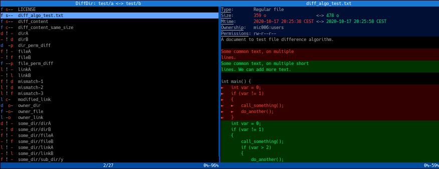

# diff-dir

- [Purpose](#Purpose)
- [Features](#Features)
- [Output](#Output)
- [Interactive mode](#Interactive-mode)
- [Options](#Options)
- [Build dependencies](#Build-dependencies)
- [Thanks](#Thanks)

## Purpose

`diff-dir` is a command line tool to compare 2 directories and get the differences.
For example, you can use it to see the changes between a directory and its last backup, or to compare 2 btrfs snapshots.



## Features

- interactive mode: browsable diff view in the terminal
- compact mode: compact but detailed view of the differences, ordered by path
- status mode: gives no output, the status code indicates if the directories are equivalent (status=0) or different (status=1) (useful for scripts)
- filter capability to ignore some patterns
- optionally compare metadata: owner (uid) and group (gid), permissions
- use modification time and size of files to avoid comparison of the file content
- multithread capability: different threads can be used to compare the directories and file content to speed-up the comparison (mostly useful on SSD or when metadata is already in cache)

Note on modification time:
- if the files on both sides have the same size and the same modification time, they are assumed to be the same: **the content is NOT checked**.
- if they have the same size but different modification time, the files contents are compared and the file is reported as different only if their content differs.

## Output

The output contains information only on the differences. The files or directories that are common are not displayed.

The output gives on each line:
- a compact information on the difference(s)
- the relative path of the difference

### File type information

The type of the file is encoded on one character
Character | File type
-|-
`f` | regular file
`d` | directory
`l` | symbolic link
`b` | bloc device
`c` | character device
`F` | FIFO
`s` | socket
`-` | no file

### File type difference

When a file exists only on one side, or when the file exists on both sides with different types, the output shows the file type on both sides separated by a `!`.

Example:
```
l ! f  conflicting_type
d ! -  path/to/dir_left_side
- ! f  some_dir/file_right_side
```

### File difference

When the file exists on both sides with the same type, the output shows:
- the common file type on the first letter
- one or several indicators indicating what is different:
  - -/s/c: **s**ize or **c**ontent
  - -/o: **o**wnership (uid or gid)
  - -/p: **p**ermissions

If an indicator has no meaning for a given file type, it is replaced by a space.

Example:
```
f s--  file_with_different_size
f c--  file_with_same_size_different_content
l c-   link_with_different_target
d  o-  /path/to/dir_with_different_ownership
f --p  /path/to/file_same_content_different_permissions
f sop  /path/to/file_with_all_differences
```

## Interactive mode

When launched in a terminal, by default, `diff-dir` will start in interactive mode.

The display is heavily inspired from [tig](https://github.com/jonas/tig):
- 2 half screens
  - side to side when the width is sufficient
  - top / bottom otherwise
  - each has a header and a footer
- first half screen contains the list of differences, one per line
- second half screen displays details on the currently selected difference of the first list
  - details on metadate: size, mtime, ownership and permissions, highlighting the differences
  - unified output of the difference for files or symbolic links
- different keys to scroll on each half screen

### Configuration

The configuration of the interactive interface is done in YAML.

`diff-dir` will load its defaults, then override with `/etc/diff-dir.conf.yaml` and finally with `~/.diff-dir.conf.yaml`, so that you can have system-level and/or user-level configuration.

The file `diff-dir.conf.yaml` from the project contains the default configuration.

### Keys / Navigation

Here is the detailed key mapping:

Key(s) | Action
-|-
Ctrl+C, Esc, q | Quit
ArrowUp, 4, u | Select previous entry in diff list
ArrowDown, 1, j | Select next entry in diff list
PageUp, i | Move one page up in diff list
Pagedown, k | Move one page down in diff list
Home | Move to top of diff list
End | Move to bottom of diff list
5, o | Move one line up in detail view
2, l | Move one line down in detail view
6, p | Move one page up in detail view
3, ;, m | Move one page down in detail view

To sum-up:
- movement keys are used for the selection (arrow, page, home/end)
- letters / digits are placed to scroll easily with one hand:
  - uiop/jkl; (or m) to scroll up/down line/page of list/detail
  - 456/123 with the same idea

## Options

Option | Description
-|-
-h, --help | help message
-v, --version | print version
-c, --compact | compact output, a single line giving the differences for one path
-s, --status | give no output, return 1 on first identified difference, 0 if no difference found
-i, --ignore path_pattern | ignore paths matching the given pattern - can be set multiple times
-m, --metadata | check and report metadata differences (ownership, permissions)
-t, --thread | use multiple threads to speed-up the comparison
-B, --buffer size | size of the buffers used for content comparison
-d, --debug | print debug information on stderr during the diff

## Build dependencies

- cmake
- google test framework for the unit tests
- yaml-cpp
- [cxxopts](https://github.com/jarro2783/cxxopts), a lightweight C++ option parser library, parsing the command line arguments (included)
- [dtl](https://github.com/cubicdaiya/dtl), diff template library written by C++, used to display the unified diff of files in the interactive detailed view (included)

## Thanks

- jarro2783 for [cxxopts](https://github.com/jarro2783/cxxopts)
- cubicdaiya for [dtl](https://github.com/cubicdaiya/dtl)
- the whole open source community for all the wonderful tools we are using everyday